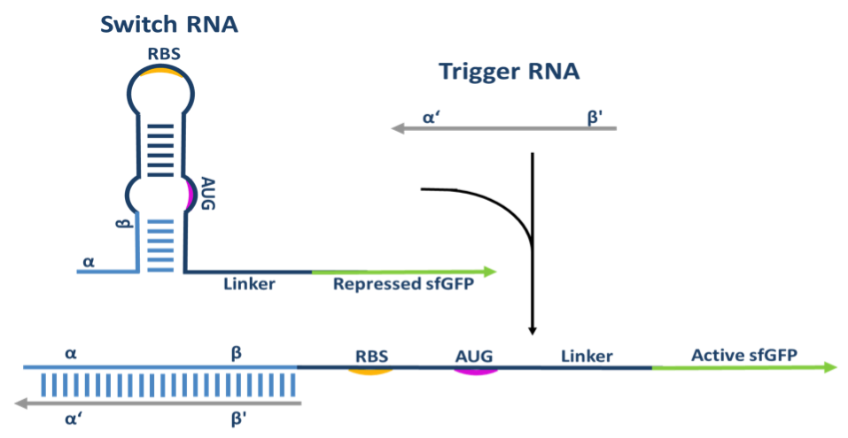

# toeholder


## Description

Toeholder is a tool that can efficiently design toehold riboswitches for the detection of a target gene. A toehold riboswitch is an RNA molecule that contains the necessary elements for the expression of a reporter gene, i. e. a ribosome binding sequence (RBS), a start codon, and the reporter gene sequence. What makes toehold riboswitches special is that they fold into a secondary structure that blocks the access of the ribosome to the RBS, thus preventing gene expression. However, they are carefully designed so that they can bind to a trigger sequence within a target gene, which results in the unfolding of the secondary structure and allows the expression of the reporter gene (Green et al. 2014. Cell.). Applications for toehold riboswitches range from detection of sequences of pathogenic organisms (Pardee, et al. 2016. Cell; Ma, et al. 2018. Synthetic Biology) to creating logical systems (Green et al. 2014. Cell; Green, et al. 2017. Nature).



Toeholder aims to facilitate the design of these molecules by offering the following capabilities:
- Testing all the different trigger sequences within a target gene.
- Simulating the secondary structure of the proposed riboswitch for each trigger.
- Simulating the binding of each toehold riboswitch to the target gene to test if it binds accurately to its corresponding trigger.
- Aligning to user-defined genomes in order to select generalist or specific riboswitches as needed

The above tests have allowed us to design toehold riboswitches for different organisms. Secondary structures obtained are very close to the ones observed for the riboswitches published by Green et al. (2014), and 70-79% of them are predicted to bind perfectly to their trigger sequences within the target gene. The remaining 21-30% are identified as binding partially or with a shift to the target or as having stop codons at undesirable positions, which allows discarding them. Finally, the alignment function has allowed us to design toeholds that are specific for the genome of a given strain, but also to select those that have matches in several strains of the same organism. All in all, these functions make toeholder a very versatile tool.

For further information, please refer to our wiki:
https://2019.igem.org/Team:ULaval

Toeholder depends on the following software. See the installation instructions below to install them.

- NUPACK (Zadeh et al. 2011. Journal of Computational Chemistry): available at http://www.nupack.org/downloads
- BLAST+ (Camacho et al. 2009. BMC Bioinformatics): available at https://blast.ncbi.nlm.nih.gov/Blast.cgi?CMD=Web&PAGE_TYPE=BlastDocs&DOC_TYPE=Download

## How to install
### On Windows :
Install WSL (Windows Subsystem for Linux) following the instructions here : https://learn.microsoft.com/en-us/windows/wsl/install
Basically, just open a PowerShell with admin rigths and do :

    wsl --install -d Ubuntu
    
Then reboot the computer. Open the newly installed linux console, create a user and add a password.

Follow the rest of the instructions for the installation in Linux.

### On Linux (Ubuntu)
1.Install dependencies :

```
sudo apt-get update
sudo apt-get upgrade
sudo apt-get install python3.12-venv build-essential python3-dev ncbi-blast+
```
    
2.Clone the repo :

```
git clone https://github.com/igem-ulaval/toeholder.git  
cd toeholder
```
    
3.Install a python virtual environment (venv) :

```
python3 -m venv bio
```
    
4.Activate the venv :

```
. bio/bin/activate
```

5.Install python librairies :

```
pip install biopython==1.77 pandas
```

(Version 1.77 is required for biopython as there was some changes in the methods used by toeholder afterwards)

6.Download nupack version 3.0.6 from here : https://www.nupack.org/download/software, and copy the file into the toeholder folder.
(You may have to enter your email to access the page.)

7.Untar and compile nupack :

```
tar -xvf nupack3.0.6.tar
cd nupack3.0.6
make
```

The compilation will throw a lot of warnings and will eventually fail at some point. Don't panic. We only need the mfe executable wich is compiled just fine. 

8.Add nupack binaries to the linux path, and also set a necessary environment variable for nupack :

```
nano ~/.bashrc
```

Scroll to the end of the file and add the following two lines :

```
export PATH=$HOME/toeholder/nupack3.0.6/bin/:$PATH
export NUPACKHOME=$HOME/toeholder/nupack3.0.6/  
```

Close the console and reopen it (WSL), logout and login again (Linux), or type this :

```
source ~/.bashrc
```

9.Create an example to test that the installation is working :
Create a file example.fasta with a dummy sequence like this :

```
>sequence #1
ggtaagtcctctagtacaaacacccccaatattgtgatataattaaaattatattcatat
tctgttgccagaaaaaacacttttaggctatattagagccatcttctttgaagcgttgtc
```

And a dummy file named reference.txt with two columns separated with the tab character

```
genome1 tag1
genome2 tag2
```

Copy the file input_variables_template.py :

```
cp input_variables_template.py input_variables.py
```

And edit the three following lines of input_variables.py:

```
[...]
# The path to the sequence for which toeholds will be designed (FASTA-formatted)
input_seq = 'example.fasta'
[...]
# The path to the output folder
output_folder = 'output'
[...]
# The path to the list of reference genomes to which candidate toeholds should be mapped
# The list should be tab-delimited, with two columns:
# 1.- Path to the genome file
# 2.- Name tag for this genome
reference_list = 'reference.txt'
```

10.Finally, run toeholder :

```
python3 toeholder.py
```

The results are generated in the output folder.
The file "all_toholder_results.txt" will give you a summary, and the individual simulations are found in the numbered folder, with the extensions .in and .mfe that can be open with a text editor or excel.


## Scripts

All scripts are written in Python 3 and depend on the following libraries

- toeholder.py: Sweeps through the sequence of the target gene looking for suitable candidate recognition sequences. All candidate recognition sequences are evaluated based on the following parameters:
	- Secondary structure on the mRNA
	- ddG of the bound (toehold + target) and unbound state (toehold and target, separately)

- input_variables.py: Defines tunable parameters and input files for the toeholder script.

- toeholder_helper_functions.py: Contains several helper functions for the other scripts.

- alignments.py: Aligns the toeholds to a selected set of reference genomes to identify matches. Toeholds matching more than one sequence or matching sequences from other genomes would not be completely specific to the target.

## Input

The workflow is fully automated to be executed as follows as long as all the scripts are in the current directory:

```
python toeholder.py
```

The input_variables.py script contains all the necessary adjustable variables for the script, including:
- Input sequence (FASTA formatted)
- Length of the unpaired region of the recognition sequence (α in the diagram)
- Length of the paired region of the recognition sequence (β in the diagram)
- Path to the output folder
- Reporter gene or tag to be added to the end of the toehold
- Input sequence molecule type (DNA or RNA)
- List of reference genomes, tab separated, and formatted as follows (without headers):

|Column 1 | Column 2 |
|-------|-----|
| path_to_genome_1 | Tag_1 |
| path_to_genome_2 | Tag_2 |
| path_to_genome_3 | Tag_3 |

- Percentage identity threshold for hits to retain from the alignments
- Evalue threshold for hits to retain from the alignments
- Minimum number of unpaired bases in the secondary structure of the target mRNA for a candidate trigger to be considered


## Output

The toeholder.py script generates an output folder with a subfolder for each of the candidate toeholds generated. When the candidate toehold contains a stop codon, its corresponding subfolder is empty. When it does not contain a stop codon, there are four files inside the subfolder:
- switch1_python.in: NUPACK-formatted input to test the toehold's secondary structure.
- switch1_python.mfe: NUPACK-formatted output with the most favorable secondary structure.
- toehold_mRNA.in: NUPACK-formatted input to test the toehold's ability to bind to the target mRNA.
- toehold_mRNA.mfe: NUPACK-formatted output with the most favorable structure of the toehold-mRNA complex.

Outside those folders, the rest of the files are:
- input_variables.py: Copy of the input variables used for this run.
- mRNA.in: NUPACK-formatted input to test the mRNA's secondary structure.
- mRNA.mfe: NUPACK-formatted output with the most favorable secondary structure for the mRNA.
- toehold_candidates.txt: First list of toeholds ranked by the number of non-paired positions in the secondary structure of the trigger region of the target mRNA.
- toehold_seqs.fasta: FASTA-formatted file containing the recognition sequences for each of the toeholds.
- all_toeholds_results.txt: Results of the tests performed on the toeholds. It adds the following columns to the toehold_candidates.txt file:
	- Toehold index
	- deltaG of binding of the toehold-mRNA complex
	- Percentage of paired bases of the toehold-mRNA complex that correspond the intended base pairing
	- deltaG of folding of the toehold secondary structure
	- deltaG of folding of the mRNA secondary structure
	- GC content of the toehold recognition sequence
	- GC content at the most stable (GC strong) and least stable (GC weak) positions from our molecular dynamics simulation of toehold 1 from Green et al., 2014. Cell
	- deltaG of refolding of the RBS-linker section of the toehold switch
- \<tag\>_toeholds_alignment.aln: Output of the BLAST alignment of the library of toeholds to the genome referenced with the corresponding tag in the genome list.
- all_toeholds_results_genome_matches.txt: Adds the counts of matches for each toehold in each of the genomes referenced in the genome list.


